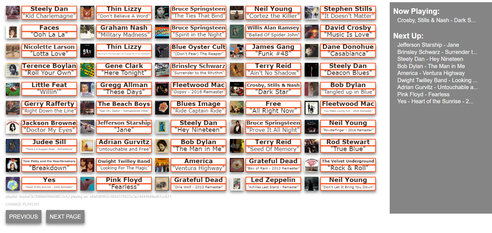

# jukebox
A jukebox web app using Spotify API - device control, playlist loaded

To deploy:
The javascript file requires five updates as the authorization information is hard-coded.

Screenshot:
  
